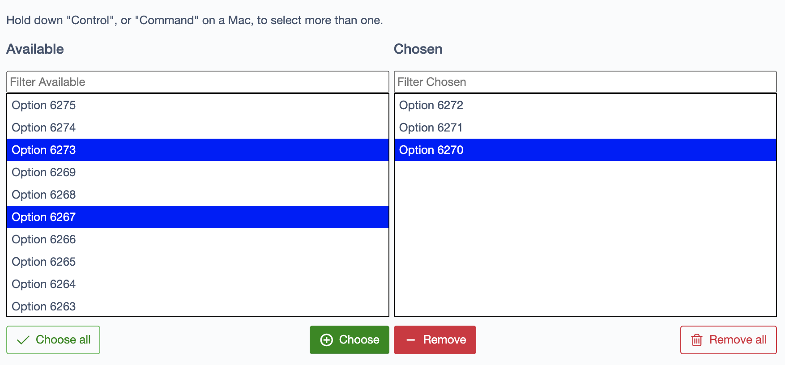

# Silverstripe two-column relation picker component 

Old-fashined component with left column with available options, right column with selected ones and some buttons to move elements between those.
Has filter fields to look up for the elements in the columns.



## Installation 

```bash
composer require gurucomkz/doubleselectrelation
composer vendor-expose
```

## Usage

```php
$offersList = Offers::get();
$offersSelector = DoubleSelectRelation::create('Offers', null, $offersList);
$fields->addFieldToTab('Root.Main', $offersSelector);
```

## TODO

* Auto-discovery of the relation options
* Checks for changes and reporting to the form to trigger "Save" button activation
* Some API maybe for programmatic control over options?
